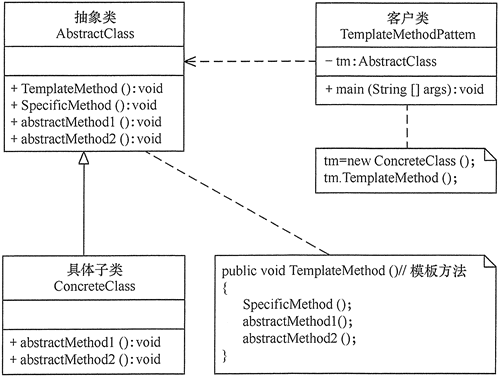
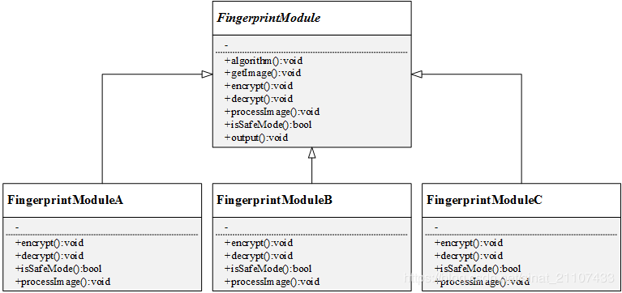

# 模板方法模式

在面向对象程序设计过程中，程序员常常会遇到这种情况：设计一个系统时知道了算法所需的关键步骤，而且确定了这些步骤的执行顺序，但某些步骤的具体实现还未知，或者说某些步骤的实现与具体的环境相关。

例如，去银行办理业务一般要经过以下4个流程：取号、排队、办理具体业务、对银行工作人员进行评分等，其中取号、排队和对银行工作人员进行评分的业务对每个客户是一样的，可以在父类中实现，但是办理具体业务却因人而异，它可能是存款、取款或者转账等，可以延迟到子类中实现。

这样的例子在生活中还有很多，例如，一个人每天会起床、吃饭、做事、睡觉等，其中“做事”的内容每天可能不同。我们把这些规定了流程或格式的实例定义成模板，允许使用者根据自己的需求去更新它，例如，简历模板、论文模板、Word 中模板文件等。

以下介绍的模板方法模式将解决以上类似的问题。
 
 

## 1 模式的定义与特点

模板方法（Template Method）模式的定义如下：定义一个操作中的算法骨架，而将算法的一些步骤延迟到子类中，使得子类可以不改变该算法结构的情况下重定义该算法的某些特定步骤。它是一种类行为型模式。

 

该模式的主要优点如下：

a） 它封装了不变部分，扩展可变部分。它把认为是不变部分的算法封装到父类中实现，而把可变部分算法由子类继承实现，便于子类继续扩展。

b） 它在父类中提取了公共的部分代码，便于代码复用。

c） 部分方法是由子类实现的，因此子类可以通过扩展方式增加相应的功能，符合开闭原则。

 

该模式的主要缺点如下：

a） 对每个不同的实现都需要定义一个子类，这会导致类的个数增加，系统更加庞大，设计也更加抽象。

b） 父类中的抽象方法由子类实现，子类执行的结果会影响父类的结果，这导致一种反向的控制结构，它提高了代码阅读的难度。

## 2 模式的结构与实现

模板方法模式需要注意抽象类与具体子类之间的协作。它用到了虚函数的多态性技术以及“不用调用我，让我来调用你”的反向控制技术。现在来介绍它们的基本结构。

 

模板方法模式包含以下主要角色：

(1) 抽象类（Abstract Class）：负责给出一个算法的轮廓和骨架。它由一个模板方法和若干个基本方法构成。这些方法的定义如下：

① 模板方法：定义了算法的骨架，按某种顺序调用其包含的基本方法。

② 基本方法：是整个算法中的一个步骤，包含以下几种类型：

a） 抽象方法：在抽象类中声明，由具体子类实现。

b） 具体方法：在抽象类中已经实现，在具体子类中可以继承或重写它。

c） 钩子方法：在抽象类中已经实现，包括用于判断的逻辑方法和需要子类重写的空方法两种。

(2) 具体子类（Concrete Class）：实现抽象类中所定义的抽象方法和钩子方法。

 

模板方法模式的结构图如图 1 所示。
 
 

 图1 模板方法模式的结构图

## 3.模板方法模式代码实例

某个指纹处理模块可以在两种模式下处理算法，即安全模式和非安全模式。在安全模式下，为了保证数据安全，某个指纹识别流程需要对采得的指纹图像进行加密，在处理图像之前再对加密数据进行解密。而非安全模式这不需要加密解密过程。指纹算法流程如下：采图——加密——解密——算法处理指纹——处理结果。现用模板方法模式模拟上述过程。

在这个实例中，Jungle首先定义了基类FingerprintModule，声明了基本方法：采图getImage()、判断是否在安全模式isSafeMode()、加密encrypt()、解密decrypt()、处理指纹图像processImage()、输出结果output()，在基类中定义了一个模板方法algorithm()，该方法里定义了指纹算法流程。

从基类FingerprintModule派生出3个子类，分别是FingerprintModuleA、FingerprintModuleB和FingerprintModuleC，三个子类的特点在于：

FingerprintModuleA：安全模式，采用RSA秘钥加解密，采用第一代版本算法处理指纹图像；
FingerprintModuleB：非安全模式，采用第二代版本算法处理指纹图像；
FingerprintModuleC：安全模式，采用DH秘钥加解密，采用第一代版本算法处理指纹图像；

