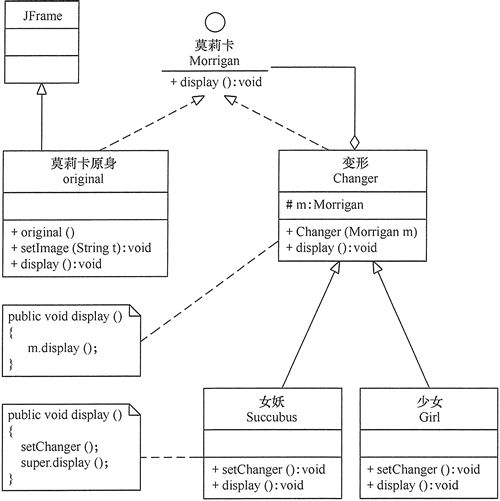
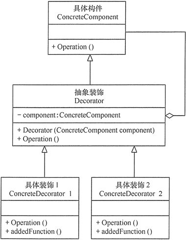

# 装饰器模式

在现实生活中，常常需要对现有产品增加新的功能或美化其外观，如房子装修、相片加相框等。在软件开发过程中，有时想用一些现存的组件。这些组件可能只是完成了一些核心功能。但在不改变其结构的情况下，可以动态地扩展其功能。所有这些都可以釆用装饰模式来实现。
 

## 1 装饰模式的定义与特点

装饰（Decorator）模式的定义：指在不改变现有对象结构的情况下，动态地给该对象增加一些职责（即增加其额外功能）的模式，它属于对象结构型模式。

 

装饰（Decorator）模式的主要优点有：

a） 采用装饰模式扩展对象的功能比采用继承方式更加灵活。

b） 可以设计出多个不同的具体装饰类，创造出多个不同行为的组合。


 其主要缺点是：

装饰模式增加了许多子类，如果过度使用会使程序变得很复杂。
 
 

## 2 装饰模式的结构与实现

通常情况下，扩展一个类的功能会使用继承方式来实现。但继承具有静态特征，耦合度高，并且随着扩展功能的增多，子类会很膨胀。如果使用组合关系来创建一个包装对象（即装饰对象）来包裹真实对象，并在保持真实对象的类结构不变的前提下，为其提供额外的功能，这就是装饰模式的目标。下面来分析其基本结构和实现方法。

装饰模式主要包含以下角色：

a） 抽象构件（Component）角色：定义一个抽象接口以规范准备接收附加责任的对象。

b） 具体构件（Concrete    Component）角色：实现抽象构件，通过装饰角色为其添加一些职责。

c） 抽象装饰（Decorator）角色：实现抽象构件，并包含具体构件的实例，可以通过其子类扩展具体构件的功能。

d） 具体装饰（ConcreteDecorator）角色：实现抽象装饰的相关方法，并给具体构件对象添加附加的责任。

 

装饰模式的结构图如图 1 所示。
 
 


 图1 装饰模式的结构图

 

## 3 装饰模式的应用实例

【例1】用装饰模式实现游戏角色“莫莉卡·安斯兰”的变身。

分析：在《恶魔战士》中，游戏角色“莫莉卡·安斯兰”的原身是一个可爱少女，但当她变身时，会变成头顶及背部延伸出蝙蝠状飞翼的女妖，当然她还可以变为穿着漂亮外衣的少女。这些都可用装饰模式来实现，在本实例中的“莫莉卡”原身有 setImage(String t) 方法决定其显示方式，而其 变身“蝙蝠状女妖”和“着装少女”可以用 setChanger() 方法来改变其外观，原身与变身后的效果用 display() 方法来显示，图 2 所示是其结构图。
 
 


 图2 游戏角色“莫莉卡·安斯兰”的结构图

 

## 4 装饰模式的应用场景

前面讲解了关于装饰模式的结构与特点，下面介绍其适用的应用场景，装饰模式通常在以下几种情况使用：

a） 当需要给一个现有类添加附加职责，而又不能采用生成子类的方法进行扩充时。例如，该类被隐藏或者该类是终极类或者采用继承方式会产生大量的子类。

b） 当需要通过对现有的一组基本功能进行排列组合而产生非常多的功能时，采用继承关系很难实现，而采用装饰模式却很好实现。

c） 当对象的功能要求可以动态地添加，也可以再动态地撤销时。


 装饰模式在 Java 语言中的最著名的应用莫过于 Java I/O 标准库的设计了。例如，InputStream 的子类 FilterInputStream，OutputStream 的子类 FilterOutputStream，Reader 的子类 BufferedReader 以及 FilterReader，还有 Writer 的子类 BufferedWriter、FilterWriter 以及 PrintWriter 等，它们都是抽象装饰类。
 
 下面代码是为 FileReader 增加缓冲区而采用的装饰类 BufferedReader 的例子：

```
BufferedReader in=new BufferedReader(new FileReader(“filename.txt”);
String s=in.readLine();
```

## 5 装饰模式的扩展

装饰模式所包含的 4 个角色不是任何时候都要存在的，在有些应用环境下模式是可以简化的，如以下两种情况：

(1) 如果只有一个具体构件而没有抽象构件时，可以让抽象装饰继承具体构件，其结构图如图 4 所示。
 
 


 图4 只有一个具体构件的装饰模式


 (2) 如果只有一个具体装饰时，可以将抽象装饰和具体装饰合并，其结构图如图 5 所示。
 
 


 图5 只有一个具体装饰的装饰模式