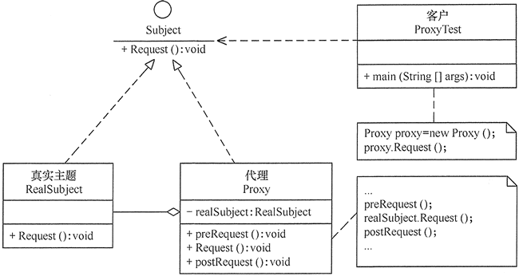

# 代理模式

在有些情况下，一个客户不能或者不想直接访问另一个对象，这时需要找一个中介帮忙完成某项任务，这个中介就是代理对象。例如，购买火车票不一定要去火车站买，可以通过 12306 网站或者去火车票代售点买。又如找女朋友、找保姆、找工作等都可以通过找中介完成。

在软件设计中，使用代理模式的例子也很多，例如，要访问的远程对象比较大（如视频或大图像等），其下载要花很多时间。还有因为安全原因需要屏蔽客户端直接访问真实对象，如某单位的内部数据库等。

## 1 代理模式的定义与特点

代理模式的定义：由于某些原因需要给某对象提供一个代理以控制对该对象的访问。这时，访问对象不适合或者不能直接引用目标对象，代理对象作为访问对象和目标对象之间的中介。

 

代理模式的主要优点有：

a） 代理模式在客户端与目标对象之间起到一个中介作用和保护目标对象的作用。

b） 代理对象可以扩展目标对象的功能。

c） 代理模式能将客户端与目标对象分离，在一定程度上降低了系统的耦合度；


 其主要缺点是：

a） 在客户端和目标对象之间增加一个代理对象，会造成请求处理速度变慢。

b） 增加了系统的复杂度。

## 2 代理模式的结构与实现

代理模式的结构比较简单，主要是通过定义一个继承抽象主题的代理来包含真实主题，从而实现对真实主题的访问，下面来分析其基本结构和实现方法。

### 2 .1 模式的结构

代理模式的主要角色如下：

a） 抽象主题（Subject）类：通过接口或抽象类声明真实主题和代理对象实现的业务方法。

b） 真实主题（Real Subject）类：实现了抽象主题中的具体业务，是代理对象所代表的真实对象，是最终要引用的对象。

c） 代理（Proxy）类：提供了与真实主题相同的接口，其内部含有对真实主题的**引用**，它可以访问、控制或扩展真实主题的功能。

 

其结构图如图 1 所示。

 


 图1 代理模式的结构图

### 2 .2 模式的实现

代理模式的实现代码请移步Eclipse。

 

## 3 代理模式的应用实例

比如有个歌手对象叫Singer，这个对象有一个唱歌方法叫sing()。

假如我们希望，通过某种方式生产出来的歌手对象，在唱歌前后还要向观众问好和答谢，也即对目标对象Singer的sing方法进行功能扩展。但是往往我们又不能直接对源代码进行修改，可能是我们希望原来的对象还保持原来的样子，又或许我们提供的只是一个可插拔的插件，甚至我们有可能都不知道要对哪个目标对象进行扩展。这时就需要用到java的代理模式了。

实现以上的需求有三种方式。

### 3 .1 静态代理

请移步Eclipse。

 

**总结：**其实这里做的事情无非就是，创建一个代理类SingerProxy，继承了ISinger接口并实现了其中的方法。只不过这种实现特意**包含**了目标对象的方法，正是这种特征使得看起来像是**“****扩展”**了目标对象的方法。假使代理对象中只是简单地对sing方法做了另一种实现而没有包含目标对象的方法，也就不能算作代理模式了。所以这里的**包含**是关键。

**缺点：**这种实现方式很直观也很简单，但其缺点是代理对象必须**提前写出**，如果接口层发生了变化，代理对象的代码也要进行维护。如果能在运行时动态地写出代理对象，不但减少了一大批代理类的代码，也少了不断维护的烦恼，不过运行时的效率必定受到影响。这种方式就是接下来的动态代理。

 

### 3 .2 动态代理（也叫JDK代理）

跟静态代理的前提一样，依然是对Singer对象进行扩展。

由于java底层**封装了实现细节**，所以代码非常简单，格式也基本上固定。

调用Proxy类的静态方法newProxyInstance即可，该方法会返回代理类对象。

```
static` `Object newProxyInstance(ClassLoader loader, Class<?>[] interfaces,InvocationHandler h )
```

接收的三个参数依次为:

·        ClassLoader loader：指定当前目标对象使用类加载器，写法固定

·        Class<?>[] interfaces：目标对象实现的接口的类型，写法固定

·        InvocationHandler h：事件处理接口，需传入一个实现类，一般直接使用匿名内部类

 

**总结：**以上代码只有很少的部分是需要自己写出，其余部分全都是固定代码。由于java封装了newProxyInstance这个方法的实现细节，所以使用起来才能这么方便。

**缺点：**可以看出静态代理和JDK代理有一个共同的缺点，就是目标对象必须实现一个或多个接口，假如没有，则可以使用Cglib代理。

 

### 3 .3 Cglib代理

前提条件：

a） 需要引入cglib的jar文件cglib-nodep-3.2.6.jar下载地址是<https://github.com/cglib/cglib/releases/tag/RELEASE_3_2_6>。

b） 目标类不能为final。

c） 目标对象的方法如果为final static，那么就不会被拦截，即不会执行目标对象额外的业务方法。

 

**总结**：三种代理模式各有优缺点和相应的适用范围，主要看目标对象是否实现了接口。

静态代理比动态代理更符合OOP原则，在日常开发中使用也较多。

动态代理在开发框架时使用较多，例如大名鼎鼎的Spring：

在Spring的AOP编程中，如果加入容器的目标对象有实现接口，用JDK代理；如果目标对象没有实现接口，用Cglib代理。

 

## 4 代理模式的应用场景

前面分析了代理模式的结构与特点，现在来分析以下的应用场景：

a） 远程代理，这种方式通常是为了隐藏目标对象存在于不同地址空间的事实，方便客户端访问。例如，用户申请某些网盘空间时，会在用户的文件系统中建立一个虚拟的硬盘，用户访问虚拟硬盘时实际访问的是网盘空间。

b） 虚拟代理，这种方式通常用于要创建的目标对象开销很大时。例如，下载一幅很大的图像需要很长时间，因某种计算比较复杂而短时间无法完成，这时可以先用小比例的虚拟代理替换真实的对象，消除用户对服务器慢的感觉。

c） 安全代理，这种方式通常用于控制不同种类客户对真实对象的访问权限。

d） 智能指引，主要用于调用目标对象时，代理附加一些额外的处理功能。例如，增加计算真实对象的引用次数的功能，这样当该对象没有被引用时，就可以自动释放它。**(智能指针)**

e） 延迟加载，指为了提高系统的性能，延迟对目标的加载。例如，Hibernate 中就存在属性的延迟加载和关联表的延时加载。


## 代理模式和装饰器模式的区别

让别人帮助你做你并不关心的事情，叫**代理模式**

为让自己的能力增强，使得增强后的自己能够使用更多的方法，拓展在自己基础之上的功能的，叫**装饰器模式**

对装饰器模式来说，装饰者（decorator）和被装饰者（decoratee）都实现同一个 接口。对代理模式来说，代理类（proxy class）和真实处理的类（real class）都实现同一个接口。他们之间的边界确实比较模糊，两者都是对类的方法进行扩展，具体区别如下：

1、装饰器模式强调的是增强自身，在被装饰之后你能够在被增强的类上使用增强后的功能。增强后你还是你，只不过能力更强了而已；代理模式强调要让别人帮你去做一些本身与你业务没有太多关系的职责（记录日志、设置缓存）。代理模式是为了实现对象的控制，因为被代理的对象往往难以直接获得或者是其内部不想暴露出来。

2、装饰模式是以对客户端透明的方式扩展对象的功能，是继承方案的一个替代方案；代理模式则是给一个对象提供一个代理对象，并由代理对象来控制对原有对象的引用；

3、装饰模式是为装饰的对象增强功能；而代理模式对代理的对象施加控制，但不对对象本身的功能进行增强；